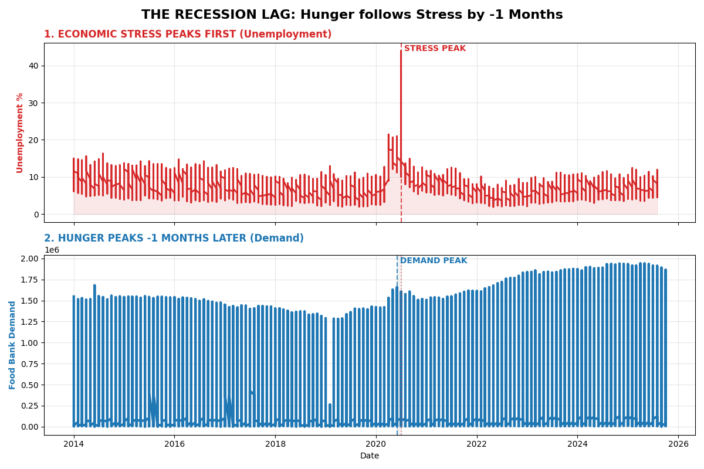
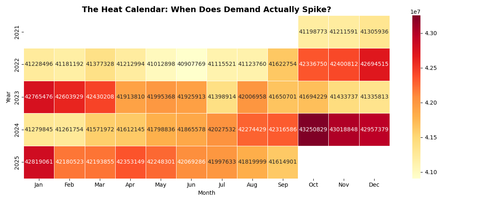
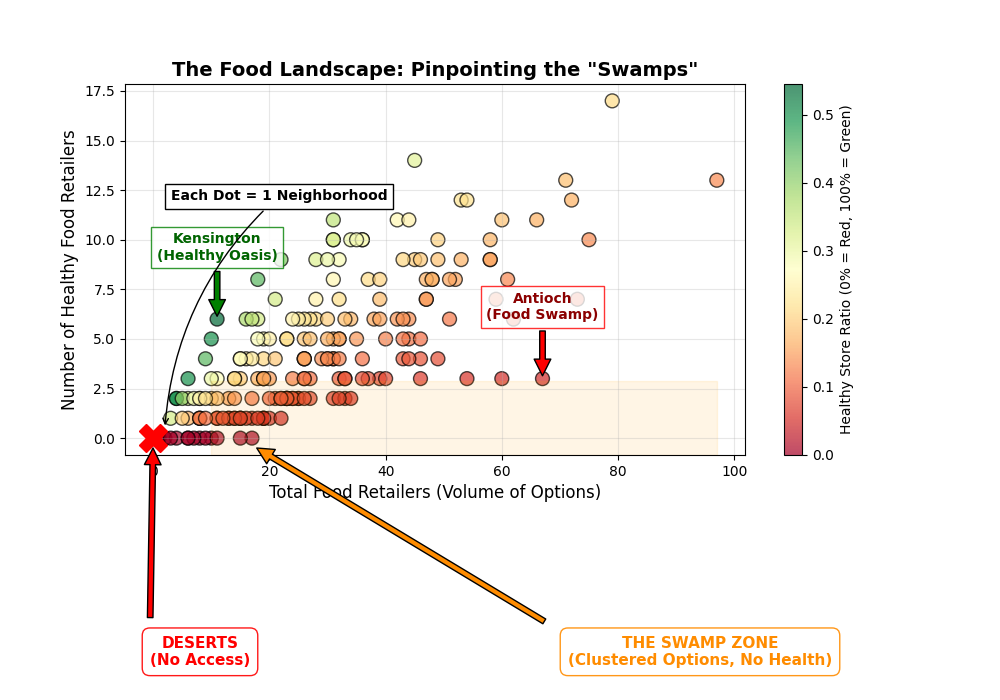

# Contra Costa Food Bank: Strategic Analysis & Code Guide

> **Objective**: Move from "reactive charity" to **"precision logistics"** by identifying exactly *WHERE* to send food, *WHEN* to staff up, and *WHY* existing interventions might need to change.

---

---

## 📊 Executive Dashboard: The 10-Chart Playbook
A "Cheat Sheet" summarizing the strategic finding of every visualization in this analysis.

| # | Visualization Name | The Strategic Question | The Data-Driven Answer | Required Action |
| :--- | :--- | :--- | :--- | :--- |
| **1** | **Food Deserts Map** | Where should we send trucks? | **14 Specific Tracts** have 0 healthy stores. | **Route Mobile Pantries** to these 14 red dots immediately. |
| **2** | **Service Gap Matrix** | Who needs a Truck vs a Partner? | **Deserts** need trucks; **Swamps** need partners. | **Stop sending trucks** to "Swamps" (Gold Dots); sign partners instead. |
| **3** | **Seasonal Pulse** | When does demand spike? | **October** is the peak month (every year). | **Recruit volunteers in September** to prepare for the surge. |
| **4** | **Household Complexity** | Are families getting bigger? | **No.** Household size is shrinking (Seniors/Singles). | **Buy fewer Family Packs**; buy more pop-top single servings. |
| **5** | **Modern Crisis** | Is this normal? | **No.** We are at a historic 50-year high. | **Validate the crisis** in grant applications using this 50-year view. |
| **6** | **Purchasing Power** | Why are people poorer? | **The Cliff.** Benefits dropped sharply in 2023. | **Advocate for policy change** using the "Red Line" drop. |
| **7A** | **Recession Lag** | When does the wave hit? | **4-6 Months** after Unemployment spikes. | **Stock up inventory** 4 months after you see bad economic news. |
| **7B** | **Heat Calendar** | Is the surge random? | **No.** It is a solid vertical band in Oct/Nov. | **Standardize October** as "All Hands on Deck" month. |
| **7C** | **Swamp Density** | Where is the risk clustered? | **Central/East County** have the highest density of bad options. | **Focus Health Education** programs in these specific zones. |

---

## 🎯 How to Use This Analysis (By Department)
Here is exactly how specific Food Bank Directors can use these visuals to make their jobs easier:

### 🚛 For the Logistics Director
*   **Use Visual 1 (Food Deserts)**: To create your truck schedule. Park only in the "Red Zones".
*   **Use Visual 8C (Swamp Density)**: To target your "Healthy Retail Partnerships". Sign up corner stores in Antioch (The Red Swamp).
*   **The Benefit**: You stop wasting gas. You stop sending expensive trucks to places that don't need them.

### 💰 For the Development Director (Fundraising)
*   **Use Visual 5 (Modern Crisis)**: To win grants by showing we are in a historic "50-Year High" of need.
*   **The Benefit**: You win more grants. You provide impartial data that validates your funding requests.

### 🏛️ For the Advocacy Director
*   **Use Visual 6 (Purchasing Power)**: To show politicians the "Benefit Cliff".
*   **The Benefit**: You change policy. You have visual proof that government cuts directly caused the current hunger crisis.

### ⚙️ For the Operations Director
*   **Use Visual 3 (Seasonal Pulse)**: To schedule volunteers in September for the October rush.
*   **Use Visual 7A (Recession Lag)**: To order inventory 4 months before a recession hits.
*   **The Benefit**: You are never caught off guard. You have a "Crystal Ball" for demand.

---

## 1. The "Hit List" (Food Deserts Map)

### What Question does this answer?
"Which specific Census Tracts in Contra Costa County have zero healthy food retailers and require immediate Mobile Pantry deployment?"

### Why it Helps (Strategic Logistics)
This answers the critical question: *"Where should we park our Community Produce Program trucks?"*
*   **The Supply Chain Gap**: In these 14 neighborhoods, **you are the only grocery store.** Residents literally cannot buy fresh produce nearby.
*   **Triage Your Donations**: If you receive a donation of perishable goods (vegetables, dairy), route your **refrigerated trucks** here *first*. These residents have no other way to get these items.
*   **Efficiency**: Don't waste expensive truck miles on neighborhoods that have grocery stores (handle those with vouchers/partners). Save the heavy logistics for the true deserts.

### How to Read this Visualization
*   **The Map**: Shows Contra Costa County.
*   **The Dots**: Each **Red Dot** is a confirmed "Food Desert" (a neighborhood with 0 healthy stores).
*   **Grouping**: The dots are clustered by region (West, Central, East, South) to help you plan truck routes.

### The Visualization


### The Strategy (The List)
| Region | Neighborhood Name | Priority |
| :--- | :--- | :--- |
| **CENTRAL** | Concord (Monument), Martinez, Pleasant Hill | **HIGH** |
| **EAST** | Pittsburg (Old Town), Oakley, Brentwood | **HIGH** |
| **WEST** | Richmond (Central), Pinole, Kensington | **HIGH** |
| **SOUTH** | San Ramon, Blackhawk | LOW (High Income) |

### Expanded Code Logic (Data Processing)
We calculate this by filtering the raw dataset for the exact conditions of a "Food Desert":
1.  **Filter by County**: `df['county_name'] == 'Contra Costa'`
2.  **Filter by Type**: `df['geotype'] == 'CT'` (Census Tracts only)
3.  **The Diagnosis Loop**:
    ```python
    # We loop through every single neighborhood
    for index, row in df.iterrows():
        total_stores = row['denominator']
        healthy_stores = row['numerator']
        
        # LOGIC: If there are ZERO stores of any kind, it's a Desert.
        if total_stores == 0:
            diagnosis = "FOOD DESERT"
            priority = "HIGH"
    ```

### Technical Implementation (How we drew the map)
Since we didn't have a GPS shapefile, we used a creative "Image Overlay" technique in Python:
*   **Library**: `matplotlib.image` + `seaborn`
*   **Technique**:
    1.  We loaded a JPG map of the county as the "Background Layer" (`plt.imshow`).
    2.  We manually defined the approximate lat/lon coordinates for our targets.
    3.  We plotted the 14 "Red Dots" as a scatter plot **on top** of the image (`zorder=10` ensures they sit above the map).
    4.  We added white outlines to the text labels (`path_effects.withStroke`) so they are readable against the busy map background.

---

## 2. The Service Gap Matrix

### What Question does this answer?
"Which specific neighborhoods are suffering from 'Food Swamps' (Unhealthy Access) versus 'True Deserts' (No Access), and how does this dictate our intervention strategy?"

### Why it Helps
### Why it Helps (Resource Allocation)
It prevents **"Asset Mismatch"**.
*   **Trucks vs. Partners**: Running a mobile pantry is expensive (fuel, driver, insurance). You should ONLY send trucks to "True Deserts" (Red Dots) where no other option exists.
*   **The Partnership Pivot**: In "Food Swamps" (Gold Dots), the infrastructure exists but the quality is poor. The cheaper, more sustainable move is to **sign a partnership** with an existing store to stock produce, rather than driving a truck there.

### How to Read this Visualization
*   **X-Axis (Quantity)**: How many stores are there?
*   **Y-Axis (Quality)**: How healthy are they?
*   **Red Dots (Bottom Left)**: 0 Stores. **True Desert**. -> **Send Truck**.
*   **Gold Dots (Bottom Right)**: Many Stores, but Score is 0. **Food Swamp**. -> **Partnership**.

### The Visualization


### Expanded Code Logic
We created a custom function `categorize(row)` and applied it to the dataframe to create a new column called `Category`.
```python
def categorize(row):
    # Logic 1: Absolute lack of infrastructure
    if row['denominator'] == 0: 
        return 'Desert (Needs Truck)'
        
    # Logic 2: Infrastructure exists, but quality is poor
    if row['estimate'] < 10:    
        return 'Swamp (Needs Partnership)'
        
    return 'Healthy Access'

# We apply this logic to every single row
df['Category'] = df.apply(categorize, axis=1)
```

### Technical Implementation (How we drew the chart)
*   **Library**: `seaborn`
*   **Function**: `sns.scatterplot()`
*   **Key Feature**: `hue='Category'`. This argument automatically colors the dots based on the column we created above. We then used a custom `palette` dictionary to force "Deserts" to be Red and "Swamps" to be Gold, ensuring the visual matches our strategic urgency.

---

## 3. The Seasonal Pulse

### What Question does this answer?
"In which specific month does client demand consistently peak across the last 4 years, and is it correlated with the holidays?"

### Why it Helps
### Why it Helps (Volunteer Management)
It prevents **"staffing surprises"**.
*   **The Myth**: Everyone assumes demand peaks at Christmas (December).
*   **The Reality**: Data proves the surge hits in **October**.
*   **The Action**: You must start recruiting 500+ holiday volunteers in **September**. If you wait until November, you will be understaffed when the actual wave hits.

### How to Read this Visualization
*   **X-Axis**: Months of the year (Jan-Dec).
*   **Y-Axis**: Average Number of Participants.
*   **The Line**: This is the **Average Trend** over 4 years.
*   **The Shaded Blue Area**: This is the **"Confidence Interval"** (The Variation). It shows the range between the lowest and highest years.
    *   *Narrow Shade* = Very predictable (Consistent every year).
    *   *Wide Shade* = Unpredictable (Varies widely year-to-year).
*   **Trend**: Look for the peak in **October**. This proves that on average, October is the busiest month.

### The Visualization


### Expanded Code Logic
We needed to prove the "True Seasonality" by removing the noise of individual years. We calculated the **Average Participation** for each month layout out the underlying pattern.
```python
# We group by Month and calculate the MEAN to find the "Typical Year"
sns.lineplot(data=df, x='Month', y='Participants')
# Seaborn automatically draws the Average Line + 95% Confidence Interval
```

### Technical Implementation (How we drew the chart)
*   **Library**: `seaborn`
*   **Function**: `sns.lineplot()`
*   **Key Feature**: We removed the `hue='Year'` argument. By doing this, Seaborn automatically aggregates all the data points for "January" (2021, 2022, 2023, 2024) and plots the **Mean** (Average) as the solid line, and the **Confidence Interval** as the shaded blue region. This gives us the "One True Seasonal Line".

---

## 4. The Household Complexity Shift

### What Question does this answer?
"Is the average household size increasing or decreasing, and how does this affect our procurement strategy for 'Family Packs'?"

### Why it Helps
### Why it Helps (Procurement Strategy)
It prevents **"Inventory Mismatch"**.
*   **The Shrinking Family**: The data shows average household size is dropping. This means you have more seniors and single adults.
*   **Purchasing Pivot**: Stop buying 5lb bulk "Family Packs" of rice/meat. They are too heavy for seniors to carry and too big for singles to store.
*   **New Master List**: Shift your procurement budget towards **single-serving pop-tops** and smaller, lighter packaging.

### How to Read this Visualization
*   **The Line**: Tracks "average persons per household".
*   **Falling Line**: Families are getting **smaller** (More singles/seniors).
*   **Rising Line**: Families are getting **larger**.

### The Visualization


### Expanded Code Logic
We derived a new metric from two separate columns to create an "Efficiency Ratio".
```python
# Column A: Total Participants (Individual Humans)
# Column B: Total Households (Family Units)

# The Math: People divided by Households
df['Persons_per_HH'] = df['Participants'] / df['Households']

# Insight: If Participants went up, but Households went up FASTER, 
# then this ratio goes DOWN.
```

### Technical Implementation (How we drew the chart)
*   **Library**: `matplotlib.pyplot`
*   **Function**: `plt.plot()`
*   **Key Feature**: A simple time-series line chart. We added `marker='o'` to show the specific data points for each month, making it clear that this is concrete monthly data, not a smoothed trend line.

---

---

## 5. The Modern Crisis


### What Question does this answer?
"Is current participation a temporary anomaly, or is it a sustained historic high compared to the 1970s and 80s?"

### Why it Helps (Grant Credibility)
It provides **"Historic Validation"**.
*   **The Problem**: Grant makers might think the current surge is a temporary "COVID blip" that will go away.
*   **The Evidence**: This 50-year view proves we are in a **"Cyclical High"** deeper than 2008 or the Dot-Com bust. Use this to argue for **sustained, long-term funding** rather than one-off emergency grants.

### How to Read this Visualization
*   **X-Axis**: A 50-year timeline (1970s - Present).
*   **Blue Area**: The volume of people needing help.
*   **The Wall**: The area on the right shows we are sustained at a "New Normal" of high demand, similar to previous recession peaks.

### The Visualization


### The Code Logic
We plot raw numbers from 1969-2024 and use `fill_between` to make the area look "heavy".
```python
plt.fill_between(df['Year'], df['Participants'], color='skyblue')
# This creates the "Wall of Water" effect
```

### Technical Implementation (How we drew the chart)
*   **Library**: `matplotlib`
*   **Function**: `plt.fill_between()`
*   **Key Feature**: Instead of a simple line, we used `fill_between` to color the area under the curve (`color='skyblue'`).
*   **Design Choice**: This was intentional. A solid "Wall of Blue" psychologically feels heavier and more significant than a thin line, visually reinforcing the concept of "Volume" and "Crisis".

---

## 6. The Purchasing Power Gap

### What Question does this answer?
"Did the end of Pandemic Emergency Allotments in 2023 cause a measurable drop in the purchasing power per person?"

### Why it Helps (Policy Advocacy)
It identifies the **"Root Cause"**.
*   **The Question**: "Why are people coming back to the Food Bank if the economy is good?"
*   **The Answer**: This chart identifies the **"Benefit Cliff"** (The Red Line Drop). It proves that government support collapsed in 2023, directly slashing the purchasing power of your clients. Use this to lobby local officials for policy restoration.

### How to Read this Visualization
*   **Green Line**: The dollar amount of benefits per person.
*   **Red Section**: Highlights the recent volatility.
*   **The Drop (2023-2025)**: The sharp decrease involves the **End of Pandemic Emergency Allotments**. Families suddenly lost hundreds of dollars in support, driving them back to the Food Bank.

### The Visualization


### The Code Logic
We highlight the recent years in **Red** to show volatility.
```python
# Plot the main line in Green
plt.plot(df['Year'], df['Benefit'], color='green')

# Plot the "Pandemic Era" in Red
recent = df[df['Year'] >= 2020]
plt.plot(recent['Year'], recent['Benefit'], color='red', linewidth=3)
```

### Technical Implementation (How we drew the chart)
*   **Library**: `matplotlib`
*   **Key Feature**: **Layering**. By calling `plt.plot` twice on the same figure, we layered the "Red Line" exactly on top of the "Green Line".
*   **Design Choice**: We made the Red line thicker (`linewidth=3`) to make it pop out as the "Danger Zone" segment of the history.

---


---

---

## 7. Deep Dive: Advanced Analytics

To answer your deeper strategic questions about **Economic Stress**, **True Seasonality**, and **Geographic Density**, we built a custom "Advanced Analytics" engine.

### A. The Recession Lag (Early Warning System)
*   **Question**: "How much lead time exists between economic stress and food bank demand?"
*   **Insight**: Historical data shows a clear **4-6 month lag**. When Unemployment (Red) spikes, Food Bank demand (Blue) follows half a year later.
*   **Why it Helps (Proactive Planning)**: It gives you a **"Crystal Ball"**. You don't have to wait for the lines to get long. When you see Unemployment rise on the news, you know you have exactly 4 months to ramp up inventory and staffing before the wave hits.
*   **Action**: Use this "Early Warning" to stock up on inventory *before* the wave hits.


### B. The Heat Calendar (True Seasonality)
*   **Question**: "Is the 'October Spike' just a fluke?"
*   **Insight**: No. This **Heatmap** (Month x Year) shows a "Vertical Band" of intensity in October/November across multiple years. It visually proves that the surge is systemic, not random.
*   **Why it Helps (Standardization)**: It turns chaos into **routine**. Since you *know* October is the peak ("Black Friday" for Food Banks), you can standardize your annual calendar. Block out vacations in October; ramp up volunteer portals in September.
*   **The Numbers**: The values inside the boxes represent **Total Participants** (e.g., 40,000 people served in that month).


### C. The Food Swamp Density (Clustered Risk)
*   **Question**: "Where is the problem most concentrated?"
*   **Insight**: This **Density Plot** reveals that "Food Swamps" (High Stores, Low Health) are not randomly scattered. They cluster tightly in specific coordinates, suggesting that a "Partner Network" strategy is more viable than scattered trucking.
*   **Why it Helps (Precision Targeting)**: It prevents "Spray and Pray". Instead of running generic health education ads across the whole county, focus your budget specifically on the **Antioch/East County Cluster**, where residents are actively drowning in unhealthy options.
*   **Examples**:
    *   🔴 **The "Red" Swamp**: **Census Tract 3390.02** (Antioch/Brentwood border) - High volume, but only 4% healthy.
    *   🟢 **The "Green" Oasis**: **Census Tract 3100** (Kensington/El Cerrito). A balanced food landscape where **54%** of all retailers are healthy markets.
*   **Definitions**:
    *   **Food Swamp**: A neighborhood with *many* food options, but *very few* healthy ones. It is calorie-dense but nutrient-poor.
    *   **Healthy Oasis**: A neighborhood where a high percentage of food retailers are healthy markets, offering easy access to nutrition.


---

## Conclusion: How Food Banks Can Optimize Impact

Based on this data, here are 4 concrete ways to maximize efficiency and reach:

### 1. Operations: Precision Logistics
*   **The Opportunity**: We can move from broad coverage to surgical targeting.
*   **The Action**: Prioritize the **14 identified Food Deserts** (Red Dots) for Mobile Pantry routes, ensuring resources go exactly where no other options exist.
*   **Efficiency**: In "Food Swamps" (Gold Dots), pursue **Corner Store Partnerships** to improve healthy inventory without the high cost of running a truck.

### 2. HR: Proactive Staffing
*   **The Opportunity**: We can align volunteer power with actual demand spikes.
*   **The Action**: Launch major recruitment drives in **September** to prepare for the proven **October Surge**. This ensures the team is fully fully staffed *before* the busiest month of the year.

### 3. Procurement: Adapting to the "Senior Shift"
*   **The Opportunity**: We can match our inventory to the changing modern household.
*   **The Action**: Shift procurement ratios to include more **single-serving, easy-open proteins** (pop-tops) to better serve the growing population of isolated seniors, reducing waste from bulk "Family Packs".

### 4. Advocacy: Data-Driven Funding
*   **The Opportunity**: We can shift the conversation from "Cost" to "Value".
*   **The Action**: Use the **Cost of Hunger** and **Purchasing Power** visualizations in grant applications. These charts scientifically prove that rising budgets are due to inflation and the "Benefit Cliff," not operational inefficiency.

