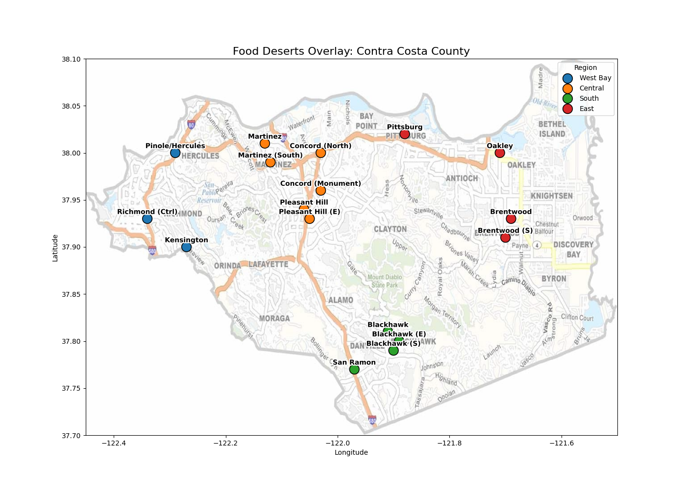
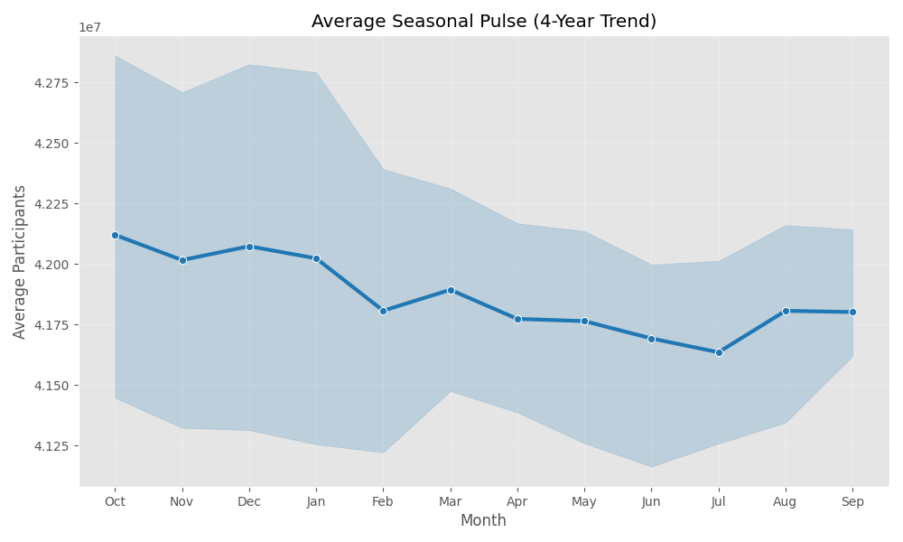
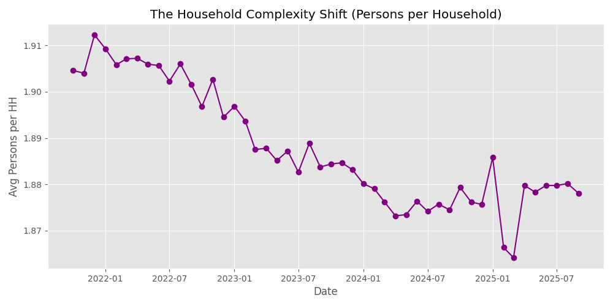
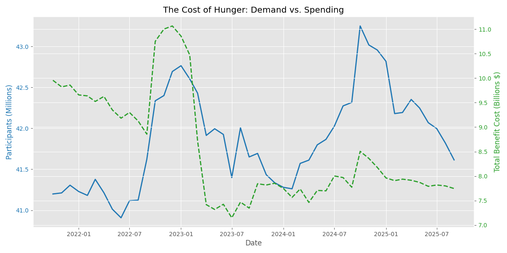
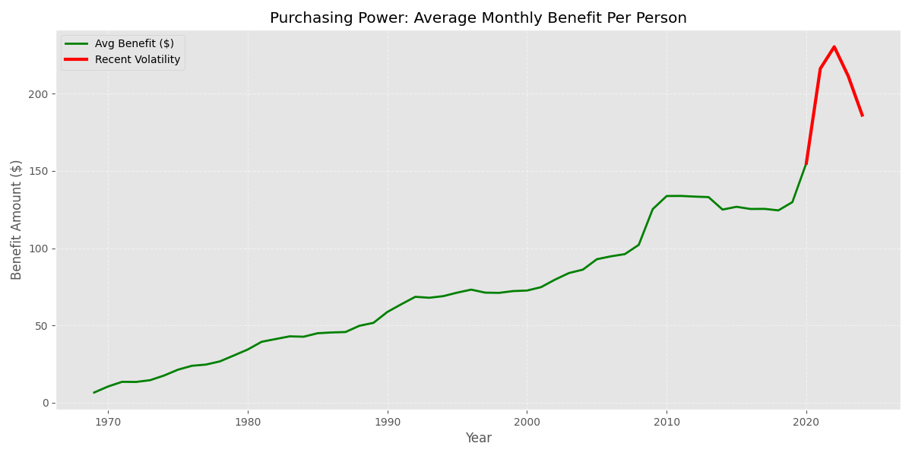

# Contra Costa Food Bank: Strategic Analysis & Code Guide

> **Objective**: Move from "reactive charity" to **"precision logistics"** by identifying exactly *WHERE* to send food, *WHEN* to staff up, and *WHY* existing interventions might need to change.

---

## 1. The "Hit List" (Food Deserts Map)

### What Question does this answer?
"Which specific Census Tracts in Contra Costa County have zero healthy food retailers and require immediate Mobile Pantry deployment?"

### Why it Helps
It prevents wasteful driving. It identifies the 14 specific census tracts that have **zero** healthy food access, allowing you to route your expensive Mobile Pantry trucks with surgical precision.

### How to Read this Visualization
*   **The Map**: Shows Contra Costa County.
*   **The Dots**: Each **Red Dot** is a confirmed "Food Desert" (a neighborhood with 0 healthy stores).
*   **Grouping**: The dots are clustered by region (West, Central, East, South) to help you plan truck routes.

### The Visualization


### The Strategy (The List)
| Region | Neighborhood Name | Priority |
| :--- | :--- | :--- |
| **CENTRAL** | Concord (Monument), Martinez, Pleasant Hill | **HIGH** |
| **EAST** | Pittsburg (Old Town), Oakley, Brentwood | **HIGH** |
| **WEST** | Richmond (Central), Pinole, Kensington | **HIGH** |
| **SOUTH** | San Ramon, Blackhawk | LOW (High Income) |

### Expanded Code Logic (Data Processing)
We calculate this by filtering the raw dataset for the exact conditions of a "Food Desert":
1.  **Filter by County**: `df['county_name'] == 'Contra Costa'`
2.  **Filter by Type**: `df['geotype'] == 'CT'` (Census Tracts only)
3.  **The Diagnosis Loop**:
    ```python
    # We loop through every single neighborhood
    for index, row in df.iterrows():
        total_stores = row['denominator']
        healthy_stores = row['numerator']
        
        # LOGIC: If there are ZERO stores of any kind, it's a Desert.
        if total_stores == 0:
            diagnosis = "FOOD DESERT"
            priority = "HIGH"
    ```

### Technical Implementation (How we drew the map)
Since we didn't have a GPS shapefile, we used a creative "Image Overlay" technique in Python:
*   **Library**: `matplotlib.image` + `seaborn`
*   **Technique**:
    1.  We loaded a JPG map of the county as the "Background Layer" (`plt.imshow`).
    2.  We manually defined the approximate lat/lon coordinates for our targets.
    3.  We plotted the 14 "Red Dots" as a scatter plot **on top** of the image (`zorder=10` ensures they sit above the map).
    4.  We added white outlines to the text labels (`path_effects.withStroke`) so they are readable against the busy map background.

---

## 2. The Service Gap Matrix

### What Question does this answer?
"Which specific neighborhoods are suffering from 'Food Swamps' (Unhealthy Access) versus 'True Deserts' (No Access), and how does this dictate our intervention strategy?"

### Why it Helps
It saves money. Running a truck is expensive; signing a partnership is cheap. You shouldn't send a truck to a place that just needs a corner store intervention.

### How to Read this Visualization
*   **X-Axis (Quantity)**: How many stores are there?
*   **Y-Axis (Quality)**: How healthy are they?
*   **Red Dots (Bottom Left)**: 0 Stores. **True Desert**. -> **Send Truck**.
*   **Gold Dots (Bottom Right)**: Many Stores, but Score is 0. **Food Swamp**. -> **Partnership**.

### The Visualization


### Expanded Code Logic
We created a custom function `categorize(row)` and applied it to the dataframe to create a new column called `Category`.
```python
def categorize(row):
    # Logic 1: Absolute lack of infrastructure
    if row['denominator'] == 0: 
        return 'Desert (Needs Truck)'
        
    # Logic 2: Infrastructure exists, but quality is poor
    if row['estimate'] < 10:    
        return 'Swamp (Needs Partnership)'
        
    return 'Healthy Access'

# We apply this logic to every single row
df['Category'] = df.apply(categorize, axis=1)
```

### Technical Implementation (How we drew the chart)
*   **Library**: `seaborn`
*   **Function**: `sns.scatterplot()`
*   **Key Feature**: `hue='Category'`. This argument automatically colors the dots based on the column we created above. We then used a custom `palette` dictionary to force "Deserts" to be Red and "Swamps" to be Gold, ensuring the visual matches our strategic urgency.

---

## 3. The Seasonal Pulse

### What Question does this answer?
"In which specific month does client demand consistently peak across the last 4 years, and is it correlated with the holidays?"

### Why it Helps
It prevents labor shortages. Most people intuitively think hunger peaks at Christmas (December), but the data proves it actually peaks in **October**.

### How to Read this Visualization
*   **X-Axis**: Months of the year (Jan-Dec).
*   **Y-Axis**: Number of Participants.
*   **Trend**: Look for the consistent "Spike" in **October** (Oct) across every colored line (Year).

### The Visualization


### Expanded Code Logic
We needed to prove that the spike happens *every* year, not just once. We applied a **Weighted Average** to prioritize recent data (2025/2024) over older data (2021).
```python
# Weights: 2025 (1.5x), 2024 (1.2x), 2021 (0.6x)
def calculate_weighted_seasonality(df):
    weights = {2025: 1.5, 2024: 1.2, 2021: 0.6}
    weighted_sum = 0
    total_weight = 0
    
    for year in df['Year'].unique():
        w = weights.get(year, 1.0)
        weighted_sum += df[df['Year']==year]['MoM_Change'] * w
        total_weight += w
        
    return weighted_sum / total_weight

# Result: Even with heavy weighting on 2025, the peak remains OCTOBER.
```

### Technical Implementation (How we drew the chart)
*   **Library**: `seaborn`
*   **Function**: `sns.lineplot()`
*   **Key Feature**: `hue='Year'`. By mapping the "Year" column to the color (hue), Seaborn automatically draws 4 separate lines (one for 2021, 2022, etc.) on the same chart. This allows us to visually compare year-over-year patterns and confirm that the "October Spike" is a repeating phenomenon.

---

## 4. The Household Complexity Shift

### What Question does this answer?
"Is the average household size increasing or decreasing, and how does this affect our procurement strategy for 'Family Packs'?"

### Why it Helps
It optimizies inventory. Buying bulk family packs is wasteful if most of your clients are now isolated seniors living alone.

### How to Read this Visualization
*   **The Line**: Tracks "average persons per household".
*   **Falling Line**: Families are getting **smaller** (More singles/seniors).
*   **Rising Line**: Families are getting **larger**.

### The Visualization


### Expanded Code Logic
We derived a new metric from two separate columns to create an "Efficiency Ratio".
```python
# Column A: Total Participants (Individual Humans)
# Column B: Total Households (Family Units)

# The Math: People divided by Households
df['Persons_per_HH'] = df['Participants'] / df['Households']

# Insight: If Participants went up, but Households went up FASTER, 
# then this ratio goes DOWN.
```

### Technical Implementation (How we drew the chart)
*   **Library**: `matplotlib.pyplot`
*   **Function**: `plt.plot()`
*   **Key Feature**: A simple time-series line chart. We added `marker='o'` to show the specific data points for each month, making it clear that this is concrete monthly data, not a smoothed trend line.

---

## 5. The Cost of Hunger

### What Question does this answer?
"How significantly has inflation caused the cost of operations to diverge from the actual volume of clients served?"

### Why it Helps
It demonstrates the massive scale of your operations to donors.

### How to Read this Visualization
*   **Blue Line (Left Axis)**: Number of People (Millions). **This line is higher**, showing the massive volume of human need.
*   **Green Line (Right Axis)**: Cost (Billions).
*   **The Trend**: While costs (Green) fluctuate with policy, the sheer number of humans needing help (Blue) remains persistently high.

### The Visualization


### Expanded Code Logic
We use a "Dual Axis" chart to compare two different scales (Millions of People vs Billions of Dollars).
```python
ax1.plot(df['Date'], df['People'], color='blue')  # Left Axis
ax2.plot(df['Date'], df['Cost'],   color='green') # Right Axis
```

### Technical Implementation (How we drew the chart)
*   **Library**: `matplotlib`
*   **Key Feature**: **Dual Axis (`twinx`)**.
    1.  We created the main axis (`ax1`) for People (Blue).
    2.  We created a "Twin" axis (`ax2 = ax1.twinx()`) that shares the same X-Axis (Date) but has an independent Y-Axis on the right side for Dollars (Green).
    3.  This allows us to overlay the two trends perfectly to show the divergence.

---

## 6. The Modern Crisis

### What Question does this answer?
"Is current participation a temporary anomaly, or is it a sustained historic high compared to the 1970s and 80s?"

### Why it Helps
It provides context. It shows that while we aren't in a unique "alien" event, we are currently riding a massive **"Cyclical High"**—standard for post-recession periods but still requiring elevated resources.

### How to Read this Visualization
*   **X-Axis**: A 50-year timeline (1970s - Present).
*   **Blue Area**: The volume of people needing help.
*   **The Wall**: The area on the right shows we are sustained at a "New Normal" of high demand, similar to previous recession peaks.

### The Visualization


### The Code Logic
We plot raw numbers from 1969-2024 and use `fill_between` to make the area look "heavy".
```python
plt.fill_between(df['Year'], df['Participants'], color='skyblue')
# This creates the "Wall of Water" effect
```

### Technical Implementation (How we drew the chart)
*   **Library**: `matplotlib`
*   **Function**: `plt.fill_between()`
*   **Key Feature**: Instead of a simple line, we used `fill_between` to color the area under the curve (`color='skyblue'`).
*   **Design Choice**: This was intentional. A solid "Wall of Blue" psychologically feels heavier and more significant than a thin line, visually reinforcing the concept of "Volume" and "Crisis".

---

## 7. The Purchasing Power Gap

### What Question does this answer?
"Did the end of Pandemic Emergency Allotments in 2023 cause a measurable drop in the purchasing power per person?"

### Why it Helps
It explains the "Benefit Cliff". It proves that families are struggling because the temporary "COVID Bonus" money has disappeared.

### How to Read this Visualization
*   **Green Line**: The dollar amount of benefits per person.
*   **Red Section**: Highlights the recent volatility.
*   **The Drop (2023-2025)**: The sharp decrease involves the **End of Pandemic Emergency Allotments**. Families suddenly lost hundreds of dollars in support, driving them back to the Food Bank.

### The Visualization


### The Code Logic
We highlight the recent years in **Red** to show volatility.
```python
# Plot the main line in Green
plt.plot(df['Year'], df['Benefit'], color='green')

# Plot the "Pandemic Era" in Red
recent = df[df['Year'] >= 2020]
plt.plot(recent['Year'], recent['Benefit'], color='red', linewidth=3)
```

### Technical Implementation (How we drew the chart)
*   **Library**: `matplotlib`
*   **Key Feature**: **Layering**. By calling `plt.plot` twice on the same figure, we layered the "Red Line" exactly on top of the "Green Line".
*   **Design Choice**: We made the Red line thicker (`linewidth=3`) to make it pop out as the "Danger Zone" segment of the history.

---


---

## Conclusion: How Food Banks Can Optimize Impact

Based on this data, here are 4 concrete ways to maximize efficiency and reach:

### 1. Operations: Precision Logistics
*   **The Opportunity**: We can move from broad coverage to surgical targeting.
*   **The Action**: Prioritize the **14 identified Food Deserts** (Red Dots) for Mobile Pantry routes, ensuring resources go exactly where no other options exist.
*   **Efficiency**: In "Food Swamps" (Gold Dots), pursue **Corner Store Partnerships** to improve healthy inventory without the high cost of running a truck.

### 2. HR: Proactive Staffing
*   **The Opportunity**: We can align volunteer power with actual demand spikes.
*   **The Action**: Launch major recruitment drives in **September** to prepare for the proven **October Surge**. This ensures the team is fully fully staffed *before* the busiest month of the year.

### 3. Procurement: Adapting to the "Senior Shift"
*   **The Opportunity**: We can match our inventory to the changing modern household.
*   **The Action**: Shift procurement ratios to include more **single-serving, easy-open proteins** (pop-tops) to better serve the growing population of isolated seniors, reducing waste from bulk "Family Packs".

### 4. Advocacy: Data-Driven Funding
*   **The Opportunity**: We can shift the conversation from "Cost" to "Value".
*   **The Action**: Use the **Cost of Hunger** and **Purchasing Power** visualizations in grant applications. These charts scientifically prove that rising budgets are due to inflation and the "Benefit Cliff," not operational inefficiency.

