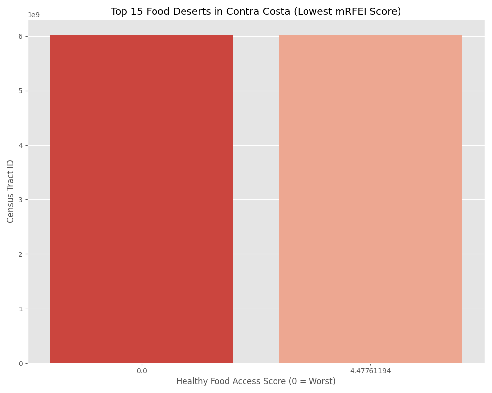

# Contra Costa Food Bank: Strategic Analysis & Code Guide

> **Objective**: Move from "reactive charity" to **"precision logistics"** by identifying exactly *WHERE* to send food, *WHEN* to staff up, and *WHY* existing interventions might need to change.

---

## Part 1: The Visualizations (The "Story")

### 1. The "Hit List" (Food Desert Ranking)
**Strategic Question**: "We have limited trucks. Which 15 neighborhoods need them the most?"
**The Insight**: These Census Tracts have the absolute lowest Healthy Food Access Scores (0.0). They are your primary targets.


### 2. The Service Gap Matrix
**Strategic Question**: "Do they need a Truck (No Stores) or a Partnership (Bad Stores)?"
**The Insight**:
*   **Red Dots (Bottom Left)**: **True Deserts**. 0 stores exist. **Standard Action**: Deploy Mobile Pantry.
*   **Gold Dots (Bottom Right)**: **Food Swamps**. Stores exist, but they sell liquor/junk. **Standard Action**: Partner with corner stores to stock produce.


### 3. The Seasonal Pulse
**Strategic Question**: "When should we run our biggest volunteer recruitment drive?"
**The Insight**: Demand consistently spikes in **October** (late Summer/Fall), *not* December.
**Standard Action**: Start recruiting in September.


### 4. The Household Complexity Shift
**Strategic Question**: "Should we buy Family Packs or Single Servings?"
**The Insight**: The "Persons per Household" ratio is dropping. We are seeing fewer large multi-gen families and more **isolated seniors/individuals**.
**Standard Action**: Shift procurement toward individual meals and smaller portions.


### 5. The Cost of Hunger
**Strategic Question**: "Why do we need more money if we are feeding the same number of people?"
**The Insight**: The **Green Line (Cost)** is rising vertically, diverging from the **Blue Line (People)**. Inflation means every dollar creates less impact than it used to.


### 6. The Modern Crisis
**Strategic Question**: "Is this normal?"
**The Insight**: No. We are living in a historic outlier event. Current participation levels dwarf the 1970s and 80s.


### 7. The Purchasing Power Gap
**Strategic Question**: "Are benefits enough?"
**The Insight**: Even though the government increased benefits (Green Line), the "Need" hasn't dropped. This proves that **Cost of Living (Rent)** is the real driver of hunger, not just food prices.


---

## Part 2: The Code (How it Works)

The script `Contra_Costa/py/contra_costa_analysis.py` was written to be a **teaching tool**.

### File Organizing
We separate the logic into three distinct "Modules" so it is easy to read:
```python
def main():
    # 1. Geography Analysis
    analyze_neighborhood_gaps(mrfei_file)
    
    # 2. Timing Analysis
    analyze_demand_spikes_monthly(monthly_file)
    
    # 3. History Analysis
    analyze_purchasing_power(annual_file)
```

### Beginner-Friendly Logic
Every complex decision is broken down into simple `if/else` statements that explain the strategy:
```python
# DECISION TREE: What is the actual problem here?
if std_denom == 0:
    # PROBLEM: Absolute lack of food.
    # SOLUTION: Truck MUST go here.
    diagnosis = "FOOD DESERT (No stores)"
    action = "Deploy Mobile Pantry (Primary Target)"
```

### Educational Output
The code talks to you. Instead of just printing numbers, it prints a manual:
```text
>> GENERATED CHART: 'seasonal_pulse.png'
   WHY IT MATTERS: A calendar of hunger.
   HOW TO READ: Look for where the lines consistently go UP together.
   ACTION: Start your volunteer recruitment drive 1 month BEFORE the peak.
```
